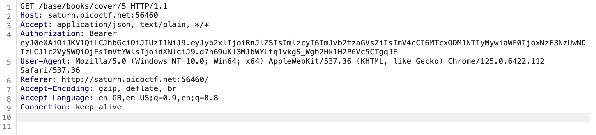
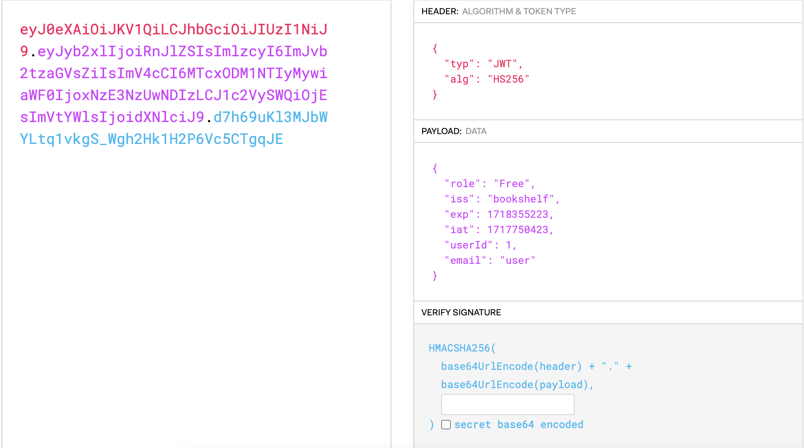
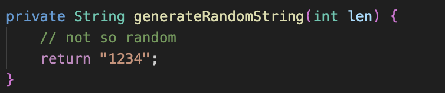
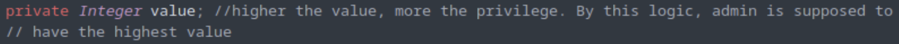
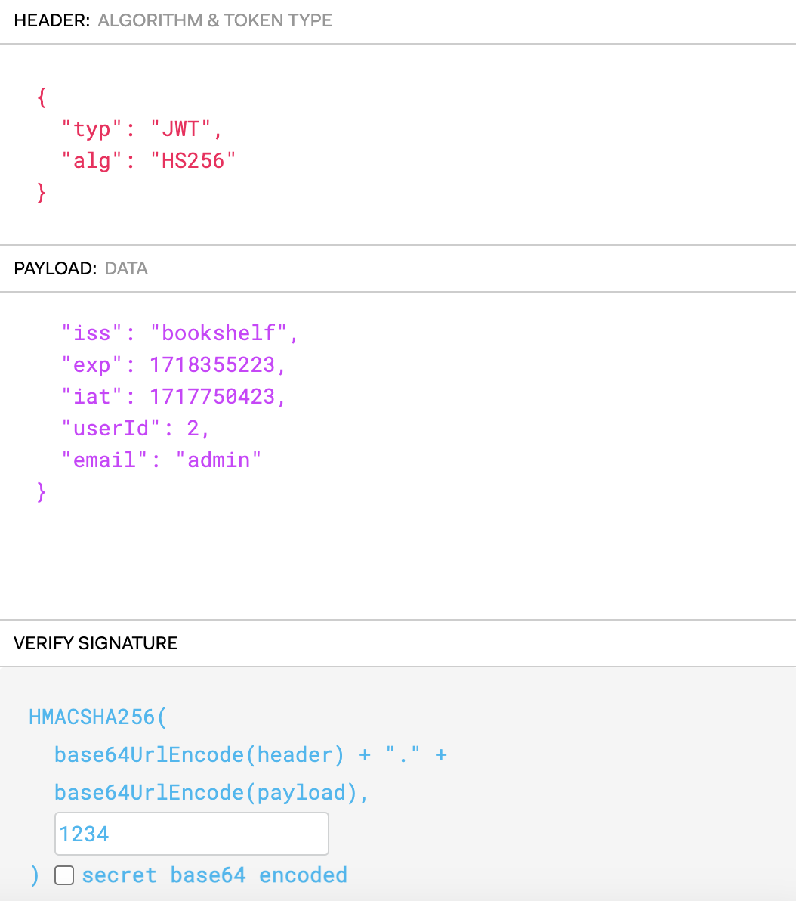

# PicoCTF 2023 Java Code Analysis
## Introduction
To begin with, we are given the source code of a bookstore website and a link to the website. The bookstore contains the book "flag" which seems to contain the flag, but it can only be accessed by admin account. The authorization is done via JWT, which can be verified by intercepting the request with burpsuite, which means that we might be able to change our authorization level if we are able to get the secret key to it.
## The JSON Web Token
Using the burp suite interceptor, I got the JWT .

With the help of the website jwt.io, we can see the encoded data

Now we just need to find the secret key to proceed with encoding the admin data into the JWT.
## Secret key
As the source code contains a lot of files, its a good idea to try to `grep` some terms and hope for some luck. The command `ls -R|grep -i "jwt"` gives us 2 files, `JwtService.java` and `JwtUserInfo.java` present in `./src/main/java/io/github/nandandesai/pico/security`.
The `JwtService.java` takes imports from another file, `SecretGenerator.java` which seems to be of interest.

The seemingly random key generator just generates 1234 as the key.
## User ID
To get the admin's user ID, we need to scrape through the source code again.
In the `Role.java` file, a comment hints us to possible user ID for the admin.

So we can take the userID as 2, as currently we only have `user` email in the free role.

Sending this token in the request, we are able to obtain the flag from the book.
`flag:picoCTF{b7794daf95ade3c353aa8618c3a7e2c6}`

## Author:Harsh-Suthar0456

