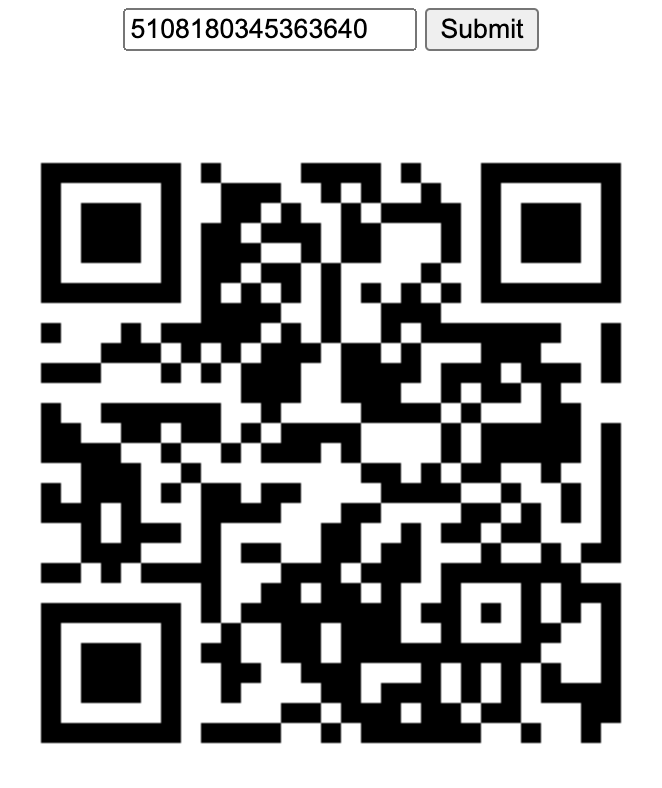

# PicoCTF 2019 JavaScript Kiddie
## Introduction
This challenge requires us to input a key in order to decrypt an image, which contains the flag.
The given link leads us to a website with a input text box and a submit button.
 ## The Page source

*The source code*
 
*The /byte webpage*
From the source code, we can figure out what is happening here:
1. Using jQuery, the "bytes" file, which seems to contain some numbers separated by spaces, is being read into the array `bytes`.
2. The `assemble_png(user_in)` function takes in the input and checks if it is 16 characters long. If not, it initialises the key to  "0000000000000000", else the input is taken as the key. 
3. This key, along with the bytes array, is used to make a `results` array. The `results` array consists of elements of bytes array at the index obtained by providing offset based on the digits of the key. The output consists of elements of result array converted to hex and separated by " ". The `data:image/png;base64+` reveals that this output is encoded to base64 bytewise to yield a PNG image.
   
Thus we need to figure out the correct key to display the image. 
## Obtaining the key
We don't need to brute force through all the possible values of the key. As the data is for a PNG image, the first 16 bytes must be equal to `89 50 4e 47 0d 0a 1a 0a 00 00 00 0d 49 48 44 52`, which corresponds to the `.PNG........IHDR` chunk. These numbers, in decimal format, must be the first 16 elements of the `results` array for the PNG to be valid. Thus we have the first 16 numbers of `results` array, `137 80 78 71 13 10 26 10 00 00 00 13 73 72 68 82`.

The encrypting function 
For the encrypting function, as we are concerned with only the first 16 numbers, we can remove the j-loop. This means that each digit of the key uniquely encodes for one of the first 16 elements of the `results` array. Thus we can write a simple python script to find the valid digits at each position in the key.

Thus we reduced down the number of possible keys to 36 different possibilities, with 3 possibilities for the 9th and 11th   positions and 4 possibilities for the 10th. We can write another short script to print all the possible values of the keys.

Brute forcing through all the possible keys, we obtain a QR code with one of the inputs.

With an online qr code decoder, we obtain the flag,
 `picoCTF{066cad9e69c5c7e5d2784185c0feb30b}`

## Author:Harsh-Suthar0456

