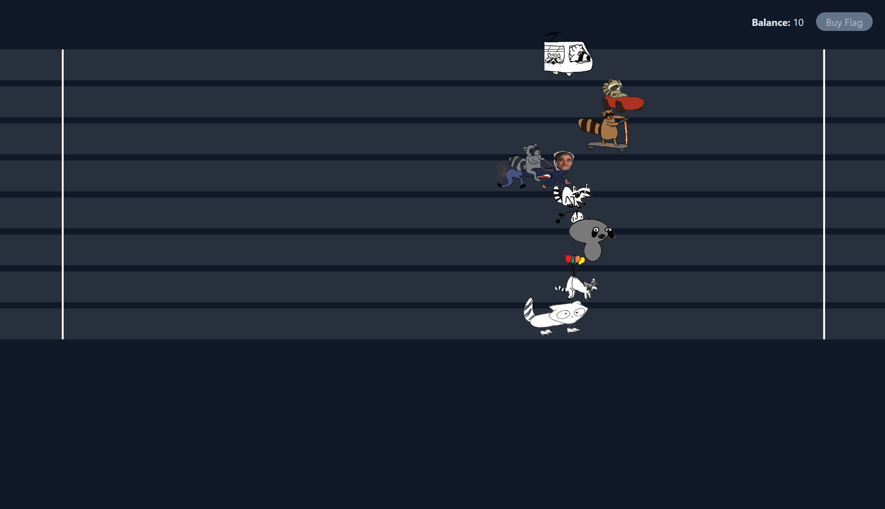

# SDCTF

## crypto/raccoon-run

### Introduction

This challenge is about cracking Mersenne Twister PRNG. In this challenge we are given the backend code, [server.py](https://github.com/acmucsd/sdctf-2024/blob/main/crypto/raccoon-run/dist/server.py).
<br><br>

It is a continuously running race between 8 raccoons, where after each round we can bet some money. We start with $10 and we need atleast $1000 to buy the flag.
We can double the money in a round by going all-out on bets and win the round, so winning 7 consecutive rounds will give us the flag.
<br><br>
In the console, we can see that the server sends raccoon positions at every step (via WebSocket).

```
...
Message from server: {"type": "race_information", "can_bet": "false", "raccoons": [258, 278, 250, 261, 251, 305, 311, 231], "finishers": [], "account": 10}
Message from server: {"type": "race_information", "can_bet": "false", "raccoons": [269, 279, 256, 265, 259, 311, 324, 245], "finishers": [], "account": 10}
Message from server: {"type": "race_information", "can_bet": "false", "raccoons": [272, 290, 267, 280, 274, 319, 332, 255], "finishers": [], "account": 10}
Message from server: {"type": "race_information", "can_bet": "false", "raccoons": [284, 291, 274, 284, 283, 330, 333, 261], "finishers": [], "account": 10}
Message from server: {"type": "race_information", "can_bet": "false", "raccoons": [287, 302, 287, 289, 291, 339, 335, 266], "finishers": [], "account": 10}
...
```

<br><br>
Observe the `step` function of `RaccoonRun` class in the code.

```python
def step(self):
    self.can_bet = False
    random_int = random.getrandbits(32)
    for i in range(NUM_RACCOONS):
        self.raccoons[i] += (random_int >> (i * 4)) % 16
    for (i, x) in enumerate(self.raccoons):
        if x >= FINISH_LINE and i not in self.finishers:
            self.finishers.append(i)
    return (self.raccoons, self.finishers)
```

A random 32-bit integer is generated at every step. The function essentially splits the 32-bit integer into 8 4-bit integers and increments each raccoon by the corresponding integer (0 index raccoon gets the least significant part, and 7 index raccoon gets the most significant part).
<br><br>
So, knowing the increment in position of each raccoon at any step, is sufficient to find out the random number at that step.
The random number can be calculated by reversing the process, i.e.,:

```python
for i in range(NUM_RACCOONS):
    random_int += raccoon_displacement[i] << (i * 4)
```

And once we know 624 such random numbers, we can predict the future random numbers.
<br><br>
We use `randcrack` python library to crack the Mersenne Twister , and `websocket` library to interact with the server.
We can write a simple script, which listens to the WebSocket, until it gets 624 consecutive random numbers, and then prints the prediction for the next 100 rounds:

```python
# the script must be started during betting period, not mid-round
import json
import websocket
import randcrack

rc = randcrack.RandCrack()
submitted = 0  # keep track of number of integers submitted to randcrack
prediction_complete = False
stop_prediction = (
    False  # bool to allow round completion if prediciton completes mid round
)
raccoon_positions = [0] * 8

NUM_RACCOONS = 8
FINISH_LINE = 1000


class RaccoonRun:
    def __init__(self):
        self.raccoons = [0] * 8
        self.finishers = []
        self.can_bet = True
        self.bet_end = 0

    def step(self):
        self.can_bet = False
        random_int = rc.predict_getrandbits(32)
        for i in range(NUM_RACCOONS):
            self.raccoons[i] += (random_int >> (i * 4)) % 16
        for i, x in enumerate(self.raccoons):
            if x >= FINISH_LINE and i not in self.finishers:
                self.finishers.append(i)
        return (self.raccoons, self.finishers)

    def game_over(self):
        return len(self.finishers) >= NUM_RACCOONS


def predict_next():
    print("Next 100 games:")
    for i in range(100):
        game = RaccoonRun()
        while not game.game_over():
            game.step()
        print(f"{i}th game: ", "".join([str(elem + 1) for elem in game.finishers]))


def on_message(wsapp, message):
    global submitted, raccoon_positions, prediction_complete, stop_prediction
    js = json.loads(message)
    if "type" not in js or stop_prediction:
        return
    if js["type"] == "race_information" and js["can_bet"] == "false":
        if submitted < 624:
            rand_int = 0
            for i, raccoon in enumerate(js["raccoons"]):
                rand_int += (raccoon - raccoon_positions[i]) << (4 * i)
            rc.submit(rand_int)
            submitted += 1
            print(f"Submitted {submitted} of 624")
        else:
            prediction_complete = True
            rc.predict_getrandbits(32)
        raccoon_positions = js["raccoons"]
    elif js["type"] == "result":
        raccoon_positions = [0] * 8
        if prediction_complete:
            stop_prediction = True
            predict_next()


wsapp = websocket.WebSocketApp("ws://127.0.0.1:xxxxx/ws", on_message=on_message)
wsapp.run_forever()
```

The script completes in around 4-5 rounds.
Once the predictions are ready, we can either write another websockets script to send in the predictions, or manually submit (only 7 rounds).
