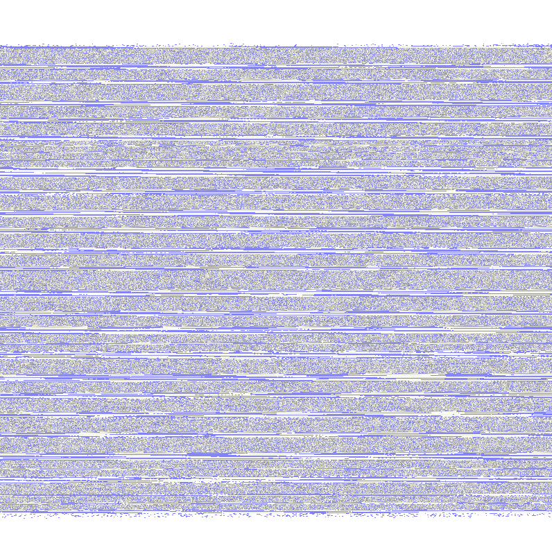

# SDCTF

## forensics/watch-the-waves

## The Problem Statement

My friend sent me this cool image. It reminds me of the ocean! I love listening to the sound of crashing waves. (flag is all lowercase)



## The Walkthrough

The name of the challenge suggests that this challenge has something to do with image-to-audio conversion. So, I have written a `python` script to convert this image into an audio file:

```python
import numpy as np
import wave
import sys
from PIL import Image
from scipy.signal import butter, filter

def image_to_wav(image_path, output_path, sample_rate=44100):
    try:
        img = Image.open(image_path).convert('L')  # Convert to grayscale
        pixels = np.array(img)

        audio_samples = ((pixels.astype(np.float64) / 255) * 65535 - 32768).astype(np.int16)
        audio_samples = audio_samples.flatten()

        return audio_samples, sample_rate
    except IOError:
        print(f"Error: Could not open or read the image file: {image_path}")
        sys.exit(1)
    Except Exception as e:
        print(f"An unexpected error occurred: {e}")
        sys.exit(1)

def butter_lowpass(cutoff, fs, order=5):
    nyq = 0.5 * fs
    normal_cutoff = cutoff / nyq
    b, a = butter(order, normal_cutoff, btype='low', analog=False)
    return b, a

def lowpass_filter(data, cutoff, fs, order=5):
    b, a = butter_lowpass(cutoff, fs, order=order)
    y = lfilter(b, a, data)
    return y

def write_to_wav(audio_samples, output_path, sample_rate):
    with wave.open(output_path, 'w') as wav_file:
        wav_file.setnchannels(1)
        wav_file.setsampwidth(2)
        wav_file.setframerate(sample_rate)
        wav_file.writeframes(audio_samples)
    print(f"Successfully converted to {output_path}")

if __name__ == "__main__":
    if len(sys.argv) < 3:
        print("Usage: python script.py <image_path> <output_path> [sample_rate]")
        sys.exit(1)

    image_path = sys.argv[1]
    output_path = sys.argv[2]
    sample_rate = 44100  # Default sample rate
    if len(sys.argv) == 4:
        sample_rate = int(sys.argv[3])

    audio_samples, sample_rate = image_to_wav(image_path, output_path, sample_rate)

    cutoff_frequency = 10000
    filtered_audio_samples = lowpass_filter(audio_samples, cutoff_frequency, sample_rate).astype(np.int16)

    write_to_wav(filtered_audio_samples, output_path, sample_rate)
```

Which gives an audio file with a lot of noise:

https://github.com/user-attachments/assets/47131a71-bdeb-4f94-9bd3-d75887d13aa6

To reduce the noise, I tried filtering the image with RED and GREEN filters (not blue, as the image's majority noise was from the blue part, clearly)

**RED:**

https://github.com/user-attachments/assets/695c6453-b8a0-4db0-a03e-0c649b5cdc44

**GREEN:**

https://github.com/user-attachments/assets/5c611d59-d909-48dc-977c-c4f8e6326606

Which gives out the flag as **`sdctf{l3tsg02th3b34ch}`**.

> [!NOTE]
> I have converted the `wav` files into `mp4` files and added them to the README so that the Markdown renderer can display them properly.
