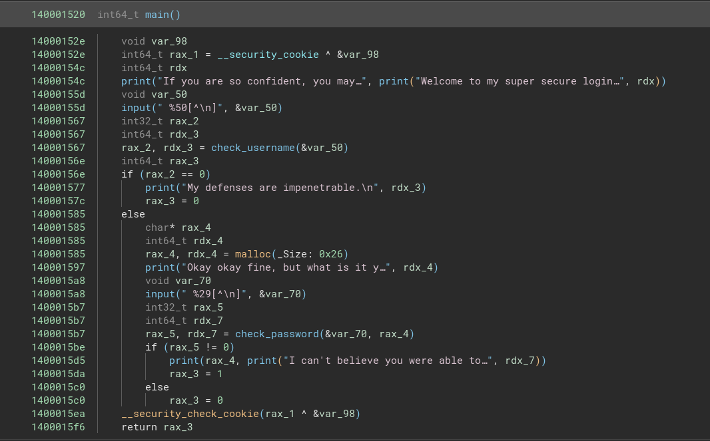
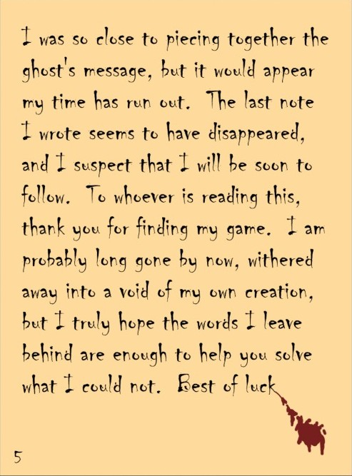

# TUCTF 2024 Writeup

This file contains the writeups for various challenges of TUCTF.

1. [Cryptography](#cryptography)
2. [Web](#web)
3. [Reverse Engineering](#rev)
4. [Miscellaneous](#miscellaneous)

## Cryptography

### My First Encryption

> I just learned about xor! Apparently it's super strong, surely it can protect my secret [file!](flag.jpeg)

In this challenge we are given a jpeg file but it wouldn't open in any image viewer. On running `file` command we find that it is labelled as `data`.

```bash
└─$ file flag.jpeg     
flag.jpeg: data
```

On seeing this, I quickly dumped its hex header to check the [magic bytes](https://en.wikipedia.org/wiki/List_of_file_signatures) of the file.

```bash
└─$ xxd flag.jpeg | head
00000000: cfe8 cfd0 3020 7a76 7976 3031 3131 3048  ....0 zvyv01110H
00000010: 3048 3030 cfd1 3012 7548 5956 3030 7d7d  0H00..0.uHYV00}}
00000020: 301a 3030 3038 3031 3122 3033 3030 3031  0.0008011"030001
00000030: 3031 3030 3030 3030 cfeb 3073 3032 3131  01000000..0s0211
00000040: 3231 3132 3232 3232 3232 3233 3533 3333  2112222222235333
00000050: 3333 3634 3433 3537 3637 3737 3637 3738  3364435767776778
00000060: 393b 3938 383a 3837 373a 3d3a 3a3b 3c3c  9;988:877:=::;<<
00000070: 3c3c 3739 3e3f 3d3c 3e3b 3c3c 3ccf eb30  <<79>?=<>;<<<..0
00000080: 7331 3232 3233 3333 3633 3336 3c38 3738  s12223336336<878
00000090: 3c3c 3c3c 3c3c 3c3c 3c3c 3c3c 3c3c 3c3c  <<<<<<<<<<<<<<<<
```

Notice that there the initial few bytes do not line up with the expected header `FF D8 FF DB` of a jpeg file. Also notice that there are a lot of occurences of the number 3 in the hexdump. Calculating the xor of the expected bytes and the actual bytes we get the output as `30303030`. This suggests the possibility that the xor key is simply 0x30 recurring. Taking the xor of the entire hexdump and resaving as a file we get the flag in the real image.

<p align="center">

</p>


<hr>

### Kraken

> The uncrackable Kraken guard hides its user's secrets. Can you uncover the secret messages?<br>
> [Attachment](kraken.py)

We are given a server that maintains a database of users along with their passwords and secret messages. On loading up the file each user is assigned a unique session_id which is generated by taking the hash of their username, password and some random bytes. We are required to create a new user who is also assigned a session_id.

```python
def gen_session_token(self, username:str, password:str):
    return hashlib.md5(username.encode('utf8') + b':' + password.encode('utf8') + b':' + random.randbytes(5)).hexdigest()
```

The random function used here is from the python's random library whose seed is set as the unpacked time of loading of the server.

```python
def prep_generator(self):
    debug_time = time.time()
    print(debug_time)
    random.seed(int.from_bytes(struct.pack('<d', debug_time), byteorder='little'))
```

Luckily, we are given a way to get the current time in the server itself. Since there is little delay between the instantiation of this seed and the time printed on the screen we can use this to search through each time instance and verify our own session_id using the random_bytes for that seed to figure out the exact seed of the random function.

```
con <- connect to server
create a new user with username="a" and password="b"
current_time <- get the time from the console
For i=1 to 10000000:
    possible_time <- current_time - (i/1000000.0)
    unpacked_time <- struct.pack(possible_time)
    random_bytes <- random.seed(unpacked_time)
    if hash("a:b:"+random_bytes[3]) == session_id[3] // Since there are 4 total users
        return random_bytes
```

After we know the seed, we essentially know the secret bytes used in computing the session_id of each of the 3 users. Combining this information with their usernames we are reduced to solving the following problem: Given $a,c,d$ find $b$ such that $hash(a+b+c)==d$. Unfortunately, we don't have any information about the passwords of other users except for the fact that they can't be of length more than 10, therefore bruteforcing all possible passwords is infeasible. Fortunately for us, all three users' passwords are found in a dictionary attack on rockyou.txt. After the passwords are known we can read their secret messages on the console and get the flag.

```bash
└─$ python3 password.py     
Checking for a: b'davy-jones', c: b'\x7f\xcfX|\x87', d: 79c795d4e716216cbec667e702aa9c4e
Found b: kingof7seas for d: 79c795d4e716216cbec667e702aa9c4e
Checking for a: b'bob', c: b'\xdd\xd1\xca`\x8e', d: 337875139a4e49d1c93c331a3a061e76
Found b: password123 for d: 337875139a4e49d1c93c331a3a061e76
Checking for a: b'blackbeard', c: b'\x91v\x10\xa0/', d: 56116a0fd0c951ab17e5feb51300e3f1
Found b: lochnessmonster for d: 56116a0fd0c951ab17e5feb51300e3f1

└─$ nc chal.tuctf.com 30001                          
Kraken Server 1.0
What is your username: What is your username: a
What is your password: b
Console $ getmessage davy-jones kingof7seas
Nothin's easy out on the water.. TUCTF{k4p714n_KR4K3N_Kn33lS
Console $ getmessage bob password123
Hi im new!
Console $ getmessage blackbeard lochnessmonster
Arrrg! You have recovered my secret... _83f0r3_y0U_329481!}
```

Here is the script used to find the hash and random_bytes:

```python
from pwn import *
import hashlib
import struct
import datetime
import random
import itertools
import time

# UNCOMMENT THIS FOR LOCAL AND COMMENT FOR REMOTE ----->
io = process(['python3', 'kraken.py'])
io.recvuntil(b'What is your username:')
sleep(0.5)

# UNCOMMENT THIS FOR REMOTE AND COMMENT FOR LOCAL ----->
# io = remote("chal.tuctf.com", 30001)
# io.recvuntil(b'What is your username: What is your username:')

my_time = time.time()
print(my_time)
io.sendline(b'a')
io.recvuntil(b'What is your password:')
io.sendline(b'b')
io.recvuntil(b'$')
io.sendline(b'time')
time = io.recvline()
io.recvuntil(b'$')
io.sendline(b'list')
lt = io.recvuntil(b'Console $')[:-9].decode().strip().split('\n')[1:]
session_ids = [i[-32:] for i in lt]

# for local testing comment the block of code below and instead set timestamp=my_time
time_str = time.decode('utf-8').strip()
time_obj = datetime.datetime.strptime(time_str, "%Y-%m-%d %H:%M:%S").replace(tzinfo=datetime.timezone.utc)
timestamp = time_obj.timestamp()

# timestamp = my_time
found_time = False
debug_mode = False

print(timestamp)
print(session_ids)

for i in range(1,50000001):
    exact_time = timestamp - i/10000000.0
    if i%1000000==0:
        print(f"{i//100000}% done")
        print(f"{exact_time:.7f}")
    random.seed(int.from_bytes(struct.pack('<d', exact_time), byteorder='little'))
    randbytes = []
    for i in range(4):
        randbytes.append(random.randbytes(5))
    if hashlib.md5(b'a:b:'+randbytes[3]).hexdigest() == session_ids[3]:
        found_time = True
        print("Found the seed!")
        break
if not found_time:
    print("Couldn't find the seed :(")
    exit(1)
print(randbytes)
if not found_time:
    exit(1)
```

<hr>

## Web

### My First Secret
> A simple login page can you get past it? And remember there are secrets you will have to figure out. After you find the flag remember that the format is TUCTF{(FLAG)} and the if the flag has spaces use _ instead when submitting.

This is a simple login page which is vulnerable to SQL Injection. Entering username = 'user' and password = `' OR 1==1` we log in successfully.

<p align="center">

</p>

Then we are given a message in some cryptic alphabet. On a quick google search this turns out to be Allomantic symbols.


<p align="center">

</p>

On mapping this to the english alphabet from [here](https://wob.coppermind.net/media/sources/317/Badali%20Steel%20Alphabet.jpg), we get the flag:     TUCTF{THERE_IS_ ALWAYS_ANOTHER_SECRET}

<hr>

### Shopping Time

In this challenge we are given a shopping platform with three items listed in the menu.

<p align='center'>

</p>

On looking through the source code, we find that the application displays those items from the database whose MD5 hash matches the hash of the requested item but the vulnerability is that it only checks the first 6 characters.

```python
from flask import Flask,render_template,request, redirect
import sqlite3
import hashlib

app = Flask(__name__)


@app.route("/")
def mainHandler():
    return render_template("index.html")

@app.route("/review")
def reviewHandler():
    con = sqlite3.connect("shopping.db")
    cur = con.cursor()
    item = request.args.get("item")
    if item == "Flag":
        return("Blacklisted term detected")
    hash = hashlib.md5(item.encode()).hexdigest()
    result = cur.execute("SELECT * FROM items WHERE id=?", (hash[0:6],))
    try:
        result = result.fetchone()
        item = result[1]
    except:
        return (redirect("/"))
    return render_template("review.html",placeholder=item,price=result[2],desc=result[3],img=result[4])


if __name__=="__main__":
    app.run(host="0.0.0.0",port=8000,debug=False)
```

To bypass the blacklist of the word Flag, we simply generate random words and check if the first 6 characters of the hash matches the hash of Flag.

```python
import hashlib
import random
import string

# Calculate the MD5 hash of "Flag"
target = hashlib.md5("Flag".encode()).hexdigest()[:6]
print(f"Target prefix: {target}")

def random_word(length=5):
    """Generate a random string of fixed length."""
    return ''.join(random.choices(string.ascii_letters, k=length))

# Brute-force to find a matching hash
while True:
    candidate = random_word()  # Generate a random candidate word
    candidate_hash = hashlib.md5(candidate.encode()).hexdigest()
    if candidate_hash[:6] == target:
        print(f"Found matching word: {candidate}")
        print(f"MD5 hash: {candidate_hash}")
        break
```

One such word is "TSLeP". Entering this in the URL gives us the flag:

<p align="center">

</p>
<hr>

## Reverse Engineering<a name="rev" />

### Simple Login

> [Attachment](simpleLogin.exe)

In this challenge we are given a windows PE file. In contrast to ELF files, PE files don't have a straightforward way of reaching the main function. Depending on the compiler used and the source code the main function could be present at different addresses in the [binary](https://stackoverflow.com/questions/73086075/entry-point-and-main-method-in-pe-executable-windows). For this challenge, I looked at the strings printed on stdout and back-referenced them to reach the main function. 

<p align='center'>

</p>

After looking through the functions and renaming them based on their actions I ended up with the following code:


<p align='center'>

</p>

Going to the `check_username` function I found that the username is being checked by a simple string compare operation.

<p align='center'>

</p>

In the check password function, the first 5 characters of the input is first matched with the string "ruint" and if it passes the arg2 is populated with the string "TUCTF" before going on to further checks.

<p align='center'>

</p>

In the more_checks function we find a subcall to a function which compares two values after taking the xor of the first value with 0x32. Using this we can figure out the next 8 characters of the password. The password now is "ruinthosepres".

<div style="display: flex; justify-content: space-between; align-items: center;">
  
  
</div>

Now looking into the even_more_checks function we see two more functions being called with arguments "reingvbaonetr" and "guebhtu_gur_fhoebhgvarf!!}" respectively. Since the password is being checked in the first function we can ignore the second one for now. 

<div style="display: flex; justify-content: space-between; align-items: center;">
  
  
</div>

Giving the code to chatgpt ;P and reversing the arguments we get the full password : "ruinthosepresercationbarge". Entering this in the binary we get the flag: `TUCTFrunning_through_the_subroutines!!}` (The missing opening curly brace was addressed in the problem description)


<hr>

## Miscellaneous

### Techno Oracle

This is a simple LLM trickery challenge. I asked the oracle for a script that encodes the flag in base64 and that gave the flag pretty quickly.

<p align='center'>

</p>

### Haunted Game

> [Attachment](MyFirstGame.zip)

This is my favourite challenge in the CTF. In this zip file we are given a Unity MonoBleedingEdge game about a person stuck in a ghost infested void. Roaming around for a while leads us to discover some notes written by a previous player about the messages the ghosts are trying to communicate.

<div style="display: flex; justify-content: space-between; align-items: center;">
  
  
  
  
</div>

From the first and second note, we get the hint that we should strip the assets of the games to get the audio files corresponding to the ghosts. Thus I download AssetStudio and strip the audio files stored in the game data.

<p align='center'>

</p>

After this I open up Audacity to look at their spectrograms.

<p align='center'>

</p>

After this point during the CTF we reshuffled the letters to form meaningful words and for the last part which just has numbers, we tried all combinations of flags to identify the right one. But after the CTF was over I realised that the intended way to solve this is by extracting the 2d textures from the game using [AssetRipper](https://github.com/AssetRipper/AssetRipper/releases) and then looking at the 3rd and 4th note.

<p align='center'>

</p>
The hex that the note refers to is of course the color of the ghosts. Also from note 3 we know that arranging the colors in their decreasing order of Alpha values (opacity) will give us the correct ordering of the flag chunks.

### Bunker

We are provided with two files. runinng file on them reveals
- Bunker_DB: Keepass password database 2.x KDBX
- Bunker_DMP: Mini DuMP crash report, 17 streams, Sun Nov 17 22:47:09 2024, 0x621826 type

Keepass is a common password manager. The database is password protected. So one might try to fine the password of the database using the memory dump provided.

A little bit of googling reveals the following tool:
[keepass-dump-extractor](https://github.com/JorianWoltjer/keepass-dump-extractor)
<p align='center'>

</p>

It only works for older versions of keepass but let us try it out

Running it on the filedump results in the following candidates for password. 
<p align='center'>

</p>

Using the password: gL0Ry_2_M4nk1Nd!_Y0RH4
(Can be bruteforced but easy to guess from wordlist)
We can unlock the database. There seems to be only one entry in the recycle bin though the password is redacted.
<p align='center'>

</p>
But looking into the history of the entry (Or saving an unencrypted databse and running strings on it). We can find the flag.
<p align='center'>

</p>

### Files in the Web

> [Attatchment](files_in_web.zip)

In thie challenge we are provided with the following files

- tornadologs.evtx: MS Windows Vista Event Log,
- Some text files

Opening the event log in an appropriate viewer (google helps)
we can see the following logs:

<p align='center'>

</p>

From this we can interpret that the file nzosdanrot.txt was encrypted using the key provided.

The contents of this file are the following:

gAAAAABnSr5MS-gH-RLqtV1ltw_hBuwujvt6S-Ku3pOdgSpAiby55EGOI3JMpv3JX6ptlhnC8cT4UdfqiIck6RDgobhASUKPJlZMkV0Js82Xx-kIHKywirHeGBqKQimJ672sPnbeWL1e


Here the prefix gAAAA indicates that the file was encrypted using fernet encryption. So it can be decrypted simply as follows:

```python
from cryptography.fernet import Fernet

key = b"UIYfpIrqvzvTedjR1qFm66K1MYYlwNgUQlgpZPfLs3k="
encrypted_data = b"gAAAAABnSr5MS-gH-RLqtV1ltw_hBuwujvt6S-Ku3pOdgSpAiby55EGOI3JMpv3JX6ptlhnC8cT4UdfqiIck6RDgobhASUKPJlZMkV0Js82Xx-kIHKywirHeGBqKQimJ672sPnbeWL1e"

f = Fernet(key)
decrypted_data = f.decrypt(encrypted_data)
print(decrypted_data.decode("utf-8"))

```

<p align='left'>

</p>

