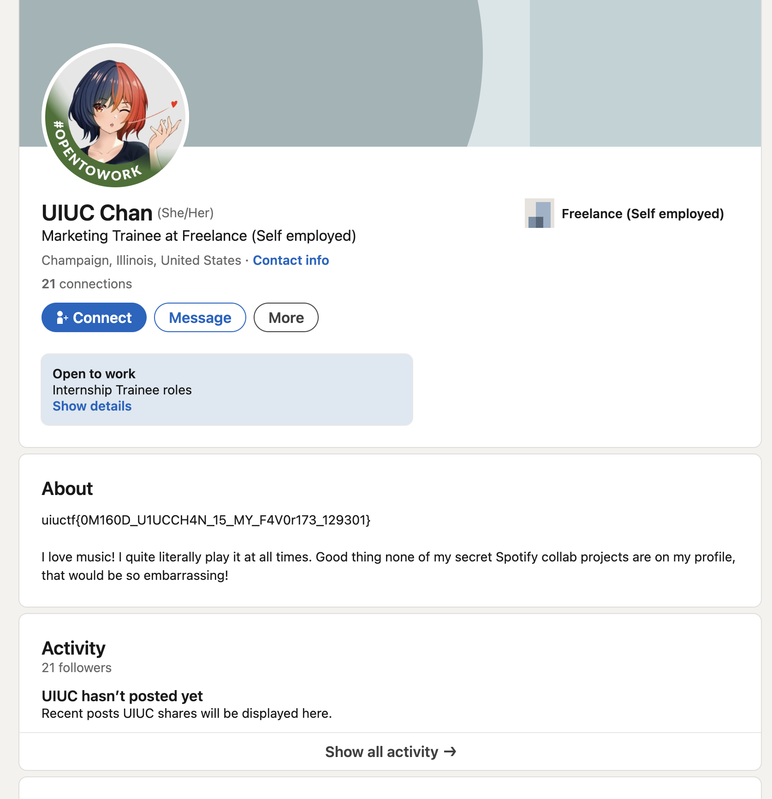

# UIUCTF

## OSINT - Long Island Subway Authority

This is a 3 part OSINT challenge.

## Part 1

To start, I searched **"Long Island Subway Authority"** on **Instagram**, which gave me this page:

The posts on Instagram have nothing much, but there even exists a **Threads** link in the Instagram profile bio, which leads to the threads page:

Scrolling through the comments of the threads by them - **First Thread**, I came across:

This thread contains the flag: ***uiuctf{7W1773r_K!113r_321879}***.

## Part 2

Using data from the first challenge, I noticed a **LinkedIn** account in the **bio of the Threads account**. Going to the LinkedIn account, I got this page:

Navigating to the skills, I got:

Viewing the one endorsement and visiting their profile:

The flag is in the bio: ***uiuctf{0M160D_U1UCCH4N_15_MY_F4V0r173_129301}***.

## Part 3

Using data collected from the second challenge, I noticed a **Contact Info** section in the **bio of the LinkedIn page of UIUC Chan**.

Opening the Spotify account, we get the following page:

Now, if I searched for the playlists under UIUC Chan and the followers' list, I tried to get some data but did not find it.
But as soon as I clicked the follow button, I got a notification under the friend activity.

Clicking on the playlist gives the following:

The flag is in the playlist info: ***uiuctf{7rU1Y_50N65_0F_7H3_5UMM3r_432013)***.

> [!NOTE]
> 
> ## This writeup was possible by team effort.
> 
> I initially couldn't find the Instagram account from a Google search. It was shared by our teammates (I found it later through an Instagram search 😋).
>
> Also, I completed Part 3 after the competition was over 😅.

## Insights:

On doing a simple Google search, we can't find the Instagram account:

Even on doing a "dork" search, we don't get much:

We cannot find any results on this as these websites are a part of the **Deep Web**.
Even though these challenges may not require you to create an account, it is better to check this as a logged-in user because you will have more viewing features without limited website access.

Use the links to read more about the [**Deep Web**](https://en.wikipedia.org/wiki/Deep_web) and [**Dorking**](https://en.wikipedia.org/wiki/Google_hacking).

# Author: Mohana Evuri
